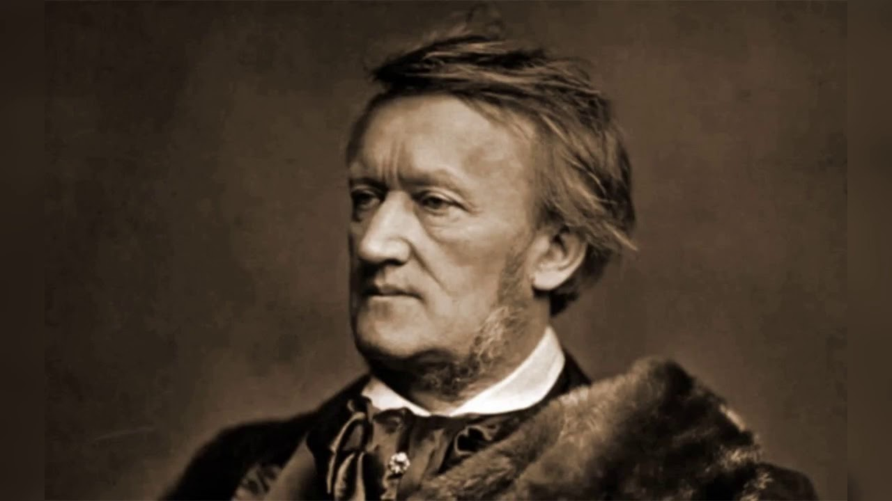

[BIOGRAFIA](biografia.md)   [OBRAS](obras.md)

 

[Wilhelm Richard Wagner (1813-1883)](https://www.youtube.com/watch?v=papllerfcGc&t=582s) fue un compositor, director de orquesta, poeta, ensayista, dramaturgo y teórico musical alemán del Romanticismo. Nació el 22 de mayo de 1813 en Leipzig, Reino de Sajonia, y falleció el 13 de febrero de 1883 en Venecia, Italia. Wagner es conocido principalmente por sus [óperas](obras.md), a las que él mismo denominaba "dramas musicales". A diferencia de otros compositores, Wagner también se encargaba de escribir los libretos y diseñar la escenografía de sus obras. Entre sus composiciones más destacadas se encuentran ["El anillo del nibelungo"](https://www.youtube.com/watch?v=sudfiLV_KmI), ["El holandés errante"](elHolandesHerrante.md), ["Tristán e Isolda"](tristanEIsolda.md) y ["Parsifal"](parsifal.md). Su infancia estuvo influenciada por su padrastro [Ludwig Geye](https://es.wikipedia.org/wiki/Ludwig_Geyer), quien era actor, pintor y poeta, y despertó en Wagner un temprano interés por las artes. Aunque Wagner fue autodidacta en gran medida, su formación musical se consolidó con el tiempo, a pesar de las dificultades económicas y profesionales que enfrentó en sus primeros años. Wagner revolucionó la música escénica con su concepto de la "obra de arte total" (Gesamtkunstwerk), que buscaba la síntesis de todas las artes poéticas, visuales, musicales y escénicas. Su influencia en la música es incuestionable, y sus innovaciones en la armonía, la orquestación y el uso de leitmotivs (temas musicales asociados a personajes o elementos de la trama) dejaron una marca duradera en la música clásica europea.

### *Vida y Carrera*
Infancia y Juventud: Wagner creció en un entorno artístico influenciado por su padrastro [Ludwig Geye](https://es.wikipedia.org/wiki/Ludwig_Geyer), quien era actor, pintor y poeta. Desde joven, mostró interés por la música y la literatura, y aunque fue en gran medida autodidacta, su formación musical se consolidó con el tiempo.

### *Primeras Obras*
Sus primeras óperas, como ["Las hadas"](lasHadas.md) y ["Rienzi"](rienzi.md), mostraban influencias de compositores como [Carl Maria von Weber](https://es.wikipedia.org/wiki/Carl_Maria_von_Weber) y [Giacomo Meyerbeer](https://es.wikipedia.org/wiki/Giacomo_Meyerbeer). Sin embargo, fue con ["El holandés errante"](elHolandesHerrante.md) (1843) cuando Wagner comenzó a desarrollar su estilo único.

### *Obras Maestras*
Wagner es conocido por sus óperas monumentales, entre las que destacan ["El anillo del nibelungo"](https://www.youtube.com/watch?v=sudfiLV_KmI), una tetralogía compuesta por ["El oro del Rin"](elOroDelRin.md), ["La valquiria"](laValquiria.md), ["Sigfrido"](sigfrido.md) y ["El ocaso de los dioses"](elOcasoDeLosDioses.md). Otras obras notables incluyen ["Tristán e Isolda"](tristanEIsolda.md), ["Parsifal"](parsifal.md) y ["Los maestros cantores de Núremberg"](losMaestrosContoresdeNurenberg.md).

### *Impacto en la Música y el Arte*
Innovaciones Musicales: Wagner revolucionó la ópera con su concepto de la ["obra de arte total"]()(Gesamtkunstwerk), que buscaba la síntesis de todas las artes poéticas, visuales, musicales y escénicas. Introdujo el uso de leitmotivs, temas musicales asociados a personajes o elementos de la trama, y su música se caracteriza por texturas complejas, armonías ricas y orquestación elaborada.

### *Influencia Duradera*
Su influencia se extiende más allá de la música, afectando la literatura, la filosofía, las artes visuales y el teatro. Wagner tuvo un impacto significativo en compositores posteriores y en el desarrollo de la música clásica moderna.

### *Controversias*
Wagner también es conocido por sus escritos polémicos sobre música, drama y política, que han generado extensos comentarios, especialmente por sus expresiones antisemitas.

### *Legado*
Wagner dejó una marca indeleble en la historia de la música y el arte. Su ópera ["Tristán e Isolda"](https://www.youtube.com/watch?v=2bbwxVBkE7g) es a menudo descrita como el inicio de la música moderna debido a su uso innovador de la armonía y la tonalidad. Además, su teatro de ópera en Bayreuth, el Festspielhaus, sigue siendo un centro importante para la interpretación de sus obras
 Su uso del leitmotiv ha sido adoptado en bandas sonoras de cine, como las de John Williams en "Star Wars".
Continúa siendo un centro de interpretación de sus obras.

 

 

 

