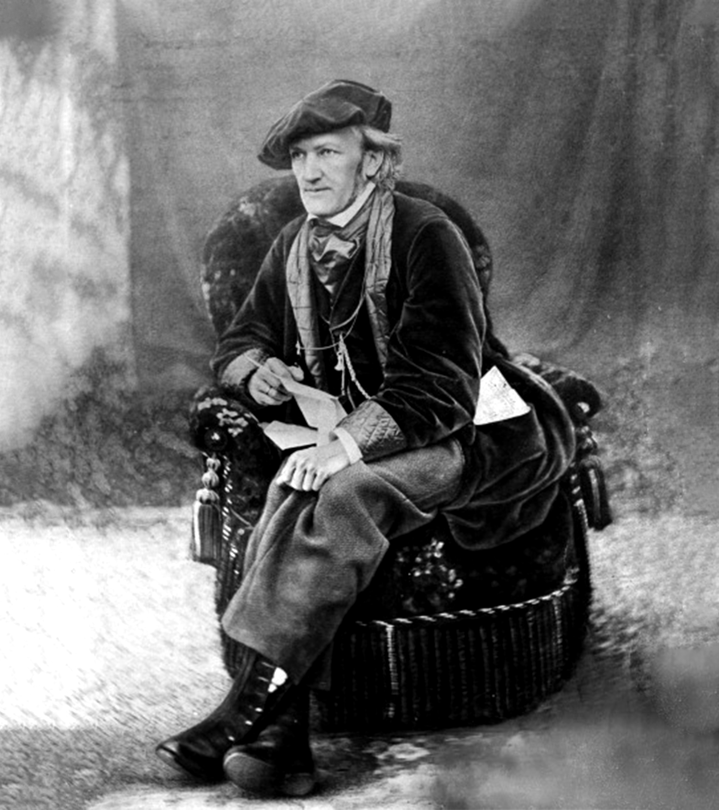

# **Biografía**

[Richard Wagner](https://www.youtube.com/watch?v=xKucDdkzvtA "Video resumen biografía"), nacido el 22 de mayo de 1813 en Leipzig, recibió muy pronto las influencias artísticas de su familia; su padre adoptivo Ludwig Geyer, que era actor y pintor, fue su primer instructor. Por otra parte, su hermana mayor Rosalie era también actriz y su otra hermana, Klara, era cantante. El destino profesional de Klara hizo que la cada de los Wagner fuese visitada por C.M. von Weber, por quien el joven sintió especial predilección que trasciende a la opera alemana.

En 1829 Richard descubrió el arte al que dedicaría toda su vida: asistió a una representación de Fidelio, quedando deslumbrado ante las dotes vocales y dramáticas de la soprano Wihelmine Schröder-Devrient (Leonora). El joven le escribió una carta esa misma noche felicitándola y profetizando su propia carrera de compositor.

Los estudios musicales de Richard comprendían el piano y el violín (en los que no destacaba), algunos elementos de teoría de la música a escondidas de su familia con G. Mullert, músico de la orquesta de Leipzig. Durante seis meses estudió con Theodor Weinlig, cantor de Santo Tomás de Leipzig, el arte de la fuga, cánones, etcétera.

Por otro lado, el interés del joven por la literatura, sobre todo clásica, le indujo a ser escritor y tras unos primeros contactos con es te genero en la escuela, Richard descubría en la opera su ideal, puesto que así podría dedicarse a los dos géneros conjuntamente.
Su carrera profesional comenzó a los veinte años, cuando fue contratado como director de coro de Würzburg. Desde ese momento, Wagner trabajó en una serie de teatros provincianos, escasos de dinero y con un público de poca categoría. El joven Richard compuso sus primera operas para tales teatros desde el puesto de director de orquesta: Las hadas (Die Feen), en Magdeburgo (1834), basada en un cuento de Gozzi (La donna serpente), que por su complejidad se estrenó en 1888 (cinco años después de su muerte), y La prohibición de amar (Das Liebesverbot), estrenada en Magdeburgo (1836) e inspirada en la obra de Shakespeare Medida por medida.

El 24 de Noviembre de 1836 se casó con la actriz Minna Planer. Pronto tuvo problemas tanto económicos como amorosos. Sus deudas acumuladas mientras trabajó en los teatros de Königsberg, Dresde y Riga, lo indujeron a huir del país.
Llevaba consigo una obra pensada para ser estrenada en un gran teatro, Rienzi. En ella imita el estilo de Meyerbeer, con grandes coros, ballet y una escenografía complicada (como el incendio del Capitolio). París sería su destino; durante la travesía hacia Londres (camino de París) una serie de terribles tempestades le inspiró una nueva opera: El holandés errante (Der fliegende Höllander).

La estancia en París fue un fracaso absoluto para Wagner. Además de no poder estrenar ninguna de sus operas, hubo de trabajar en reducciones para piano y canto de operas italianas por las que tomó gran aversión.

Incluso permaneció un breve tiempo en la cárcel de deudores, puesto que sus deudas se acumulaban rápidamente y los ingresos escaseaban. Finalmente fue la ciudad de Dresde la que, gracias a la ayuda de Meyerbeer, aceptó el estreno de Rienzi. Wagner abandonó París con amargura, pero con las esperanzas puestas en su propia patria.
Rienzi se estrenó el 20 de Octubre de 1842 con gran éxito, a pesar de su estilo parisiense de gran envergadura (cinco horas). Wagner fue desde entonces un compositor considerado en su patria.

## El comienzo el drama musical wagneriano

El mismo Teatro Real de Dresde aceptó El holandés errante en 1842-1843. Wagner daba un paso de gran importancia hacia el drama musical al utilizar desde la obertura la unión de temas musicales con los personajes principales, los sentimientos y los hechos del drama, adquiriendo gradualmente la noción de leitmotiv o tema conductor, que sería esencial en la forma de componer sus óperas posteriores. Por otro lado, la influencia de Weber aumenta su interés por el mundo germánico, sobre todo por el mítico y legendario, tan importante en la tradición cultural alemana.

Así El holandés es una leyenda germánica sobre el capitán blasfemo que cada siete años desembarca en tierra con la esperanza de que el amor redentor de una mujer fiel lo libere de la maldición a la que ha sido condenado.

A pesar de los cambios estilísticos, Wagner todavía utiliza las arias y dúos tradicionales, que poco a poco irán desapareciendo en sus nuevas obras. La ópera no tuvo la acogida de Rienzi, pero gracias a ella consiguió el puesto de director de cámara de la casa real de Sajonia.

Con Tannhäuser, estrenada en Dresde en 1845, avanzaba en la utilización de los temas conductores, ahora más extensos. Revive el mundo legendario medieval de los caballeros Minnesinger alemanes, equivalentes a los trovadores provenzales. Pero aquí el drama toma un aspecto religioso enfrentándose, por un lado, el amor "carnal" que simboliza la diosa Venus y, por otro, el amor espiritual de Elisabeth.

La obra comienza en el Venusberg, donde permanece Tannhäuser junto a la diosa. El caballero añora el mundo terrenal y consigue que Venus le permita volver a él. Una vez en la región de Turingia (principios de siglo XIII), reencuentra a sus compañeros de canto y caballería, que al pronunciar el nombre de Elisabeth (antiguo amor del caballero) consiguen que Tannhäuser los acompañe hasta el castillo, donde los esperan para celebrar uno de los concursos.

El landgrave de Turingia lo abre. Tannhäuser, en medio de una alucinación, realiza el exaltado canto sobre los placeres del Venusberg (utilizando para ello su leitmotiv). Ante tal osadía los caballeros presentes lo rodean para matarlo; pero intercede Elisabeth por él y logra que los caballeros acepten que Tannhäuser vaya en peregrinación a Roma para que el papa le perdone. En el acto tercero, Elisabeth, viendo que Tannhäuser no regresa, muere encomendándose a la Virgen para que su amado logre el perdón. De vuelta al valle de Turingia, Tannhäuser al conocer el hecho renuncia al Venusberg y muere junto a su amada mientras un grupo de peregrinos provenientes de Roma anuncian que el santo padre le ha perdonado al fin.

El constante entrelazamiento de los diferentes temas conductores, perfectamente adaptadas al texto, consigue que la música transcurra a través del propio texto. La idea de Wagner es utilizar la música como medio para llegar al drama; al contrario de la opera italiana donde el drama es el medio para llegar a la música.
En Lohengrin utiliza el nuevo método dramático musical en forma intensiva. En la obertura, por ejemplo, escuchamos el "tema del misterio" y el del santo Grial; este último reaparece en la misma forma tras casi cuatro horas de ópera, cuando Lohengrin se identifica como un caballero del Santo Grial.

A pesar de que Wagner creía en la eficacia de su sistema, éste realmente tenía sus fisuras, ya que para sus contemporáneos era muy difícil reconocer los numerosos temas que configuran la música y que se relacionaban íntimamente con el texto; sistema que casi nadie comprendía por su complejidad y porque sus óperas sólo se representaban en pocos teatros.
Richard Wagner comenzó la composición de Lohengrin en 1845, pero la participación activa por parte del compositor en los hechos revolucionarios de Dresde (1848-1849) le obligaron a refugiarse primero en Weimar junto a Listz y, al decretarse la orden de busca y captura contra él, a exiliarse en Suiza.
Lohengrin fue por tanto la primera ópera que se estrenó en Alemania (Weimar, 28 de Agosto de 1850) mientras Richard permanecía en el exilio. En ella encontramos aún influencias notablemente italianizantes y meyerbeerianas.

## El mecenazgo del rey Luis II de Baviera

Cuando el compositor se había retirado a Mariafeld (cerca de Zurich, mayo de 1864) huyendo de sus acreedores se le presentó como un milagro el secretario del gabinete de Luis II para indicarle que el rey, su más ardiente admirador, se sentiría halagado si aceptase ser su invitado. Rápidamente fueron pagadas las numerosas deudas contraídas por el compositor que se instaló cómodamente en una casa cercana a la residencia de verano del rey en Berg. Para él compuso La marcha del Homenaje.
El 1 de Junio de 1865 se estrenó Tristán e Isolda en Munich, mientras Wagner comenzaba su autobiografía Mi vida (Mein Leben). Pero se supo que había iniciado relaciones con Cosima Listz y fueron aprovechadas para una intriga cortesana que obligó a Luis II a pedirle que se alejase un tiempo de Munich. Se trasladó a Suiza y, tras la muerte de su esposa Minna en Dresde (1866), se instaló con Cosima en la hermosa villa de Triebschen a orillas del lago de Ginebra, con sus cuatro hijas.
Richard pudo trabajar en sus óperas sin preocuparse de sus gastos y en 1867 terminaba Los maestros cantores de Nuremberg (Die Meistersinger von Nürnberg); una obra concebida en teoría como ópera cómica, pero que en realidad es una aproximación a las costumbres de la época de los Cantores Gremiales (Meistersingers) alemanes.

Continuó viviendo en Triebschen, donde frecuentemente le visitaba Nietzsche. A lo largo de 1869 terminó Sigfrido casi por entero; las últimas páginas las acabaría en 1871. El 22 de septiembre de 1869 presentó El oro del Rin en Munich, mientras iniciaba la composición de El ocaso de los dioses. Ese poema fue leído por Wagner en Dresde, Zurich y París con notable éxito. Los amigos mostraban su admiración ante la epopeya del héroe germano, si bien ponían ciertos reparos de la viablidad de su representación escénica y la ilación del ## Argumento. Tras largos años de convivir con Wagner, Cósima se divorcia de Hans von Bülow y se casa con Richard (1870); para su cumpleaños él le compuso El idilio de Sigfrido. Por ésta época viajó Wagner sucesivamente a Alemania para preparar el camuino de su Fesrspielhaus en Bayreuth y para la fundación de la Sociedad Wagner. El día de su quincuagésimo noveno cumpleaños puso la primera piedra del Teatro de Bayreuth, y al año siguiente realizó una gira de conciertos por Alemania para recoger fondos, y finalmene y gracias a la generosa ayuda de Luis II se pudo terminar.

Ese mismo año (1874) construyó su casa Wahnfried de Bayreuth, a la que se trasladó. En ella terminó El ocaso de los dioses, dando fin a la Tetralogía, que fue estrenada formando tres ciclos completos en Bayreuth (1876). Las pérdidas económicas fueron cuantiosas; pero era el espectáculo que todos querían ver. Después del festival, Wagner se trasladó con su familia a Londres. Donde dirigió una serie de conciertos para captar fondos que cubriesen las pérdidas de Bayreuth. Poco después se le presentaron sus primeros problemas de corazíon, por lo que se trasladó a Bad Ems (1877) para una cura de salud.

## Parsifal, la última opera

En 1882 Wagner terminó su última ópera, Parsifal, en Palermo; tomó como modelo el Parzival de Wolfram von Echenbach (1160-1220 aprox.) quien, a su vez, había sacado el ## Argumento de antiguas leyendas bretonas. La trama se centra en la montaña de Monsalvat, donde los caballeros del Santo Grial guardan celosamente el cáliz sagrado de la última cena. Amfortas, rey de los caballeros, fue seducido por Kundry y aprovechando su debilidad, Klingsor, un caballero réprobo y ambicioso, le había quitado la santa alianza hiriéndole con ella. Desde entonces la herida no había dejado de sangrar.

Una profecía que había de un joven puro que salvará a Amfortas es la única esperanza. Cierto día lleha un joven puro, que no conoce su nombre ni a sus padres; Gurnemanz, uno de los caballeros, lo lleva al ágape sagrado, pero al ver que el joven no da señales de ser el enviado de la profecía le hace salir del castillo. Parsifal, sin embargo, vencerá a Kundry y a Klingsor recuperando la lanza sagrada.

En el último acto ha pasado mucho tiempo y Parsifal retorna al castillo del Grial. Es Viernes Santo; Guernemanz reconoce ahora al salvador de la profecía y lo proclama como nuevo rey del Grial. Se dirigen a la sala donde permanecen Amfortas y los caballeros, Parsifal toca la herida de Amfortas, que queda curado. Entonces descubre el grial, que recupera su purísma luz, mientras que desde el cielo desciende una paloma blanca sobre los caballeros, momento en que Kundry, que se ha convertido, muere.

El último drama wagneriano es de hecho un cuadro místico cristiano. Parsifal se convierte al din en mensajero de salvación, Kunfry y Amfortas representan el símbolo de la culpa y la superción.
Wagner sufrió un primer ataque al corazón en Berlín (1881) y el segundo en Bayreuth, donde ya repuesto estrenó el 26 de julio de 1882 Parsifal, dando 16 funciones en las que el trercer acto de cada una de ellas fue dirigida por el propio compositor. Se trasladó a Venecia para recuperar su salud ya muy deteriorada; pero en 13 de febrero de 1883 moría en dicha ciudad. El día 18 fue enterrado en el jardín de Wahnfried, en Bayreuth, donde después se enterró también a su esposa.

[Inicio](README.md)  [OBRAS](obras.md)