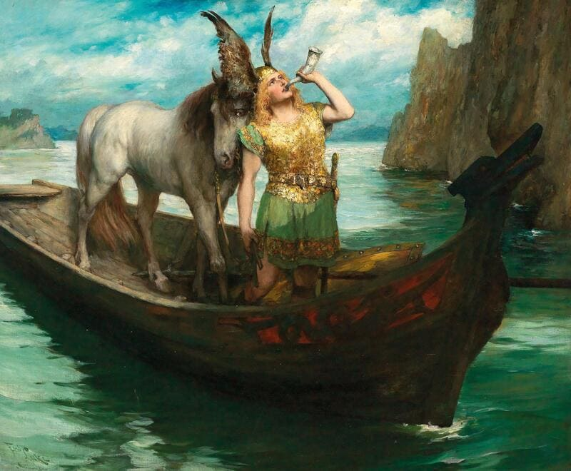

# **El Ocaso de los Dioses**  

El ocaso de los dioses (Götterdämmerung) es la cuarta y última ópera del ciclo El anillo del nibelungo (Der Ring des Nibelungen) de Richard Wagner, estrenada el 17 de agosto de 1876 en el Festival de Bayreuth. La obra culmina la épica saga de poder, traición y redención centrada en el anillo mágico forjado por el enano Alberich.

## Argumento

La ópera se divide en un prólogo y tres actos, y sigue las consecuencias de la maldición del anillo y la caída de los dioses.

#### Prólogo  

Las Nornas, hijas de Erda, tejen la cuerda del destino y predicen el fin de los dioses. La cuerda se rompe, simbolizando el caos inminente.
Siegfried y Brünnhilde se despiden. Siegfried le entrega el anillo a Brünnhilde como símbolo de su amor y parte en busca de nuevas aventuras.

#### Acto I  

Siegfried llega al palacio de los Gibichungos. Hagen, hijo de Alberich, conspira para apoderarse del anillo.
Hagen da a Siegfried una poción que le hace olvidar a Brünnhilde y enamorarse de Gutrune, hermana de Hagen.
Siegfried, bajo el influjo de la poción, ayuda a Gunther, hermano de Hagen, a conquistar a Brünnhilde.

#### Acto II  

Hagen manipula a Brünnhilde, Gunther y Gutrune para que conspiren contra Siegfried.
Durante una cacería, Hagen asesina a Siegfried, quien en sus últimos momentos recuerda a Brünnhilde.

#### Acto III  

Brünnhilde, devastada por la muerte de Siegfried, decide sacrificarse para romper la maldición del anillo.
Se inmola en una pira funeraria, devolviendo el anillo a las Hijas del Rin.
El Valhalla es consumido por las llamas, marcando el fin de los dioses.

## Música y Estilo

"El ocaso de los dioses" es conocida por su compleja orquestación y el uso de leitmotivs para representar personajes y conceptos. La ópera incluye momentos musicales destacados como la "Marcha fúnebre de Siegfried" y la "Inmolación de Brünnhilde".

## Recepción y Legado

La ópera es una de las más ambiciosas de Wagner y se representa regularmente en teatros de todo el mundo. "El ocaso de los dioses" es fundamental para entender la culminación del ciclo del Anillo y la visión de Wagner sobre el destino y la redención.  

## Enlaces de interés 
El ocaso de los dioses - Wikipedia, la enciclopedia libre  
El ocaso de los dioses (Götterdämmerung) Wagner - La Opera  

 [Inicio](README.md)  [BIOGRAFIA](biografia.md) 