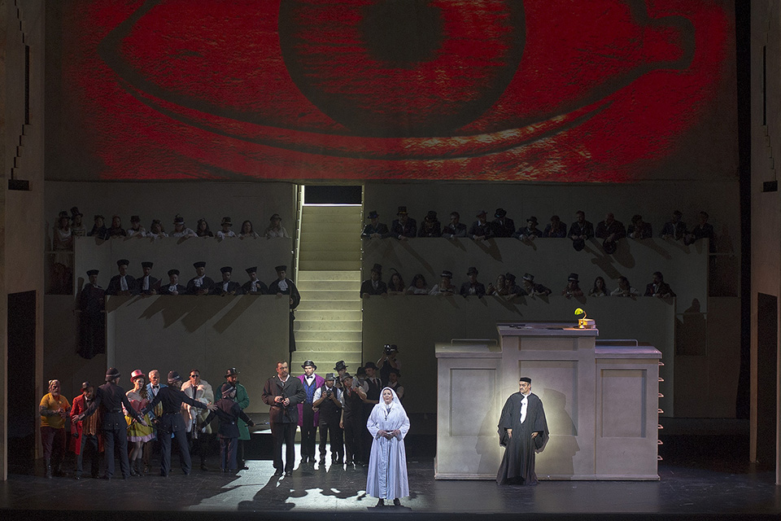

[Óperas](obras.md)
# **La prohibición de Amar**

La prohibición de amar (Das Liebesverbot) es una ópera cómica en dos actos, compuesta por Richard Wagner en 1834 Basada en la obra "Medida por medida" de William Shakespeare, la ópera se estrenó en Magdeburgo el 29 de marzo de 1836 

## Argumento

La historia se desarrolla en Palermo, Sicilia, durante el siglo XVI El gobernador alemán Friedrich impone estrictas leyes morales, prohibiendo el amor fuera del matrimonio y castigando severamente cualquier actividad sexual pecaminosa

#### Acto I  

Claudio, un noble siciliano, es arrestado por violar las leyes de Friedrich

Lucio, amigo de Claudio, visita a Isabel, hermana de Claudio y novicia, para pedirle que interceda por su hermano

Isabel descubre que Friedrich ha engañado a su amiga Mariana y se indigna

Isabel se enfrenta a Friedrich, quien le propone perdonar a Claudio a cambio de su amor

#### Acto II  

Isabel informa a Claudio de la propuesta de Friedrich, y Claudio prefiere morir antes que deshonrar a su hermana 

Isabel y su amiga Dorella organizan un engaño para desenmascarar a Friedrich

Durante el carnaval, Friedrich es engañado por Mariana, quien se hace pasar por Isabel

Isabel revela la traición de Friedrich y logra liberar a Claudio

Isabel acepta casarse con Lucio y todos celebran el regreso del rey

## Recepción y Legado

La ópera fue un fracaso en su estreno debido a problemas con el elenco y nunca se representó nuevamente durante la vida de Wagner Sin embargo, "La prohibición de amar" es interesante por su crítica al puritanismo y su celebración del amor libre Además, es notable por ser una de las primeras obras en las que Wagner utiliza la técnica del leitmotiv  

## Enlaces de interés 

[La prohibición de amar - Wikipedia, la enciclopedia libre](https://es.wikipedia.org/wiki/La_prohibici%C3%B3n_de_amar)  
[La prohibición de amar | Una fábula moral | My Opera Player ](https://www.myoperaplayer.com/videoteca/extras/la-prohibicion-de-amar-una-fabula-moral)   
[La prohibición de amar video](https://www.youtube.com/watch?v=Xbx-WPpUAKU) 

 [Inicio](README.md)  [BIOGRAFIA](biografia.md) 
