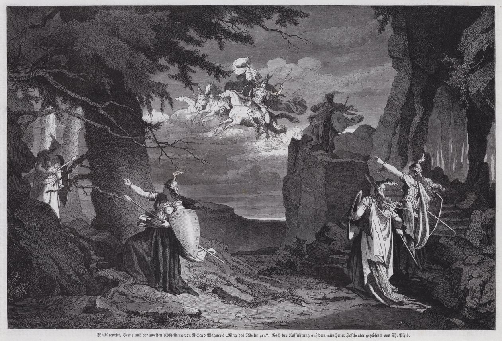

[Óperas](obras.md)
# **La Valquiria**  

La Valquiria (Die Walküre) es la segunda ópera del ciclo El anillo del nibelungo (Der Ring des Nibelungen) de Richard Wagner, estrenada el 26 de junio de 1870 en Múnich. La obra se basa en la mitología nórdica y germánica, y es conocida por su poderosa música y compleja narrativa.

## Argumento 

La ópera se divide en tres actos y sigue la historia de los gemelos Siegmund y Sieglinde, hijos de Wotan, el dios principal, y su lucha por el amor y la libertad.

#### Acto I  

Siegmund busca refugio en la casa de Hunding durante una tormenta.
Sieglinde, esposa de Hunding, cuida de Siegmund y ambos sienten una atracción inmediata.
Siegmund descubre que Sieglinde es su hermana gemela y extrae una espada mágica, Notung, del tronco de un fresno, dejada allí por su padre Wotan.

#### Acto II  

Wotan ordena a su hija, la valquiria Brünnhilde, que proteja a Siegmund en su duelo con Hunding.
Fricka, esposa de Wotan y diosa del matrimonio, exige que Siegmund muera por su relación incestuosa con Sieglinde.
Wotan cede a las demandas de Fricka y ordena a Brünnhilde que no intervenga.
Brünnhilde, conmovida por el amor de Siegmund y Sieglinde, desobedece a Wotan y trata de proteger a Siegmund, pero Wotan interviene y Siegmund es asesinado por Hunding.

#### Acto III 

Brünnhilde huye con Sieglinde, quien está embarazada del hijo de Siegmund, Siegfried.
Las valquirias intentan esconder a Brünnhilde, pero Wotan la encuentra y la castiga por su desobediencia.
Wotan condena a Brünnhilde a dormir en una roca rodeada de fuego, donde solo un héroe sin miedo podrá despertarla.

## Música y Estilo 

"La Valquiria" es famosa por su "Cabalgata de las valquirias", una de las piezas más reconocibles de Wagner. La ópera utiliza leitmotivs para representar personajes y conceptos, una técnica que Wagner perfeccionó en sus obras posteriores.

## Recepción y Legado

"La Valquiria" es una de las óperas más populares de Wagner y se representa regularmente en teatros de todo el mundo. La obra es un hito en la evolución del drama musical de Wagner, mostrando su habilidad para combinar música y narrativa de manera innovadora.

## Enlaces de interés 
[Wagner: La Valquiria (Die Walküre) - La Opera](https://laopera.net/wagner/wagner-la-valquiria-die-walkure)  
[LA VALKYRIA (Walküren) de Richard Wagner – la guía y sinopsis de la ópera](https://opera-inside.com/la-valkyria-walkuren-de-richard-wagner-la-guia-y-sinopsis-de-la-opera/?lang=es)     
[La Valquiria video](https://www.youtube.com/watch?v=_C-0hH5G8MU&t=64s)

 [Inicio](README.md)  [BIOGRAFIA](biografia.md) 
