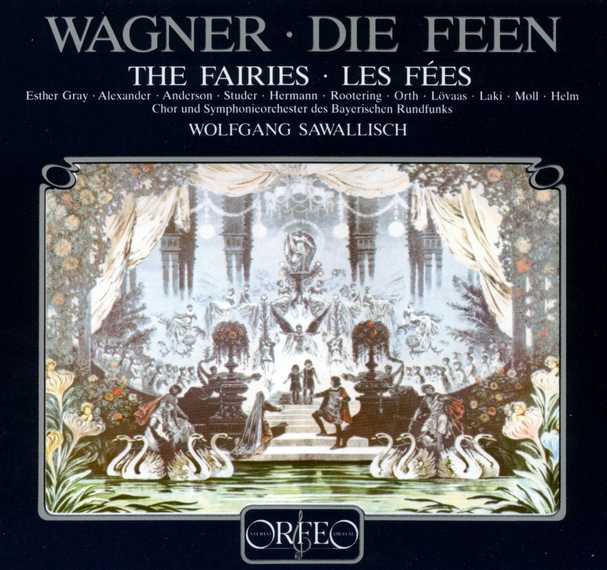

[Óperas](obras.md)
# **Las hadas**  

Las hadas (Die Feen) es la primera ópera completa de Richard Wagner, compuesta en 1833 pero estrenada póstumamente en 1888. La ópera está basada en la obra "La donna serpente" de Carlo Gozzi y se desarrolla en tres actos.

## Argumento

La historia sigue a Arindal, un príncipe humano, y Ada, un hada, quienes se enamoran. Sin embargo, su amor enfrenta numerosos obstáculos debido a la naturaleza mágica de Ada y las leyes del reino de las hadas. Arindal debe superar varias pruebas para poder estar con Ada, incluyendo enfrentarse a un mago malvado y resistir la tentación de abandonar su amor.

Personajes Principales  

Arindal: Príncipe humano y protagonista.

Ada: Hada y amada de Arindal.

Groma: Mago antagonista.

Lora: Hermana de Arindal.

Morald: Prometido de Lora.

## Música y Estilo 

La música de "Las hadas" refleja la influencia de Carl Maria von Weber, especialmente en su ópera "El cazador furtivo" Aunque no contiene las innovaciones maduras de Wagner como el leitmotiv y la armonía cromática, muestra su talento emergente y su capacidad para combinar drama y música
## Recepción y Legado

"Las hadas" no se representó durante la vida de Wagner y es una de sus obras menos conocidas Sin embargo, ofrece una visión temprana de su desarrollo como compositor y su habilidad para crear narrativas operísticas complejas.

## Enlaces de interés 
[Las hadas - Wikipedia, la enciclopedia libre](https://es.wikipedia.org/wiki/Las_hadas)  
[Las hadas (Die Feen) Richard Wagner - La Opera](https://laopera.net/wagner/las-hadas-die-feen-richard-wagner)  
[Las hadas video](https://www.youtube.com/watch?v=nRQoIYuukzc)

 [Inicio](README.md)  [BIOGRAFIA](biografia.md) 