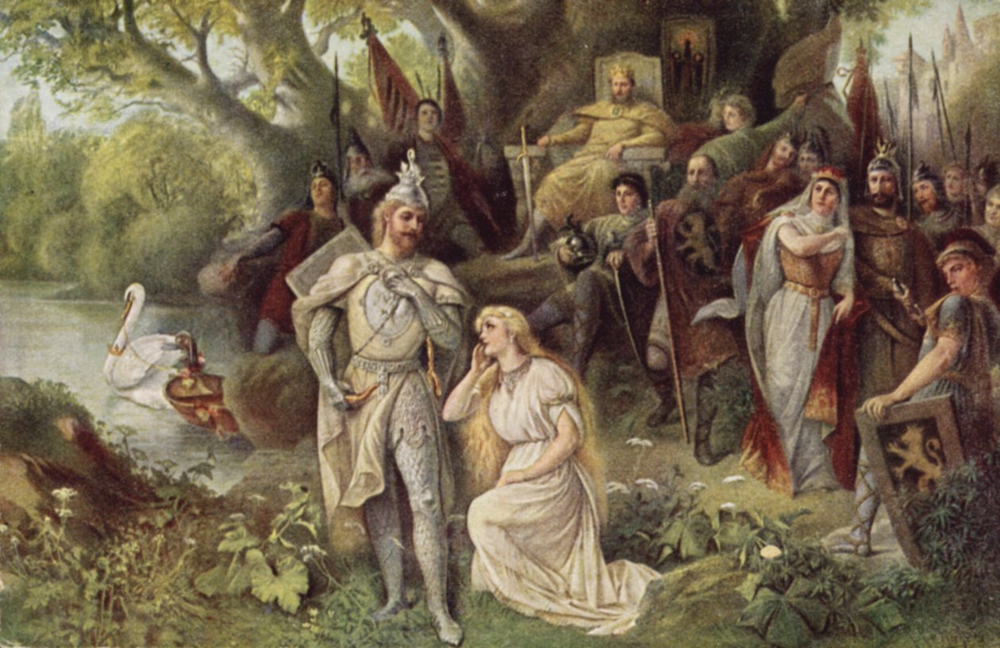

# **Lohengrin** 

Lohengrin es una ópera romántica en tres actos con música y libreto de Richard Wagner, estrenada el 28 de agosto de 1850 en Weimar, bajo la dirección de Franz Liszt. La historia se basa en leyendas medievales alemanas, especialmente en el "Parzival" de Wolfram von Eschenbach y su secuela "Lohengrin".

## Argumento

La ópera se desarrolla en el siglo X en la ciudad de Amberes, en el río Escalda.

#### Acto I  

El rey Enrique I llega a Brabante para reunir a las tribus alemanas contra los húngaros y resolver la desaparición del duque Gottfried.
Friedrich von Telramund acusa a Elsa de Brabante de haber asesinado a su hermano Gottfried y reclama el ducado.
Elsa, en su defensa, describe a un caballero que ha visto en sus sueños y que será su campeón.
Aparece Lohengrin, traído por un cisne, y se ofrece como campeón de Elsa, con la condición de que nunca le pregunte su nombre ni su origen.
Lohengrin derrota a Telramund en combate y declara la inocencia de Elsa.

#### Acto II  

Ortrud, esposa de Telramund y una hechicera pagana, planea vengarse de Lohengrin y Elsa.
Ortrud convence a Elsa de que debe preguntar a Lohengrin sobre su origen.
Durante la noche, Telramund y Ortrud intentan desacreditar a Lohengrin, pero fallan.

#### Acto III  

En la boda de Lohengrin y Elsa, Telramund ataca a Lohengrin, pero es asesinado.
Elsa, presionada por las dudas sembradas por Ortrud, pregunta a Lohengrin sobre su origen.
Lohengrin revela que es un caballero del Santo Grial y que debe regresar al castillo del Grial porque su identidad ha sido descubierta.
Antes de partir, Lohengrin transforma al cisne en el hermano perdido de Elsa, Gottfried.
Lohengrin se despide y Elsa muere de pena.

## Música y Estilo 

"Lohengrin" es conocida por su preludio, la famosa "Marcha nupcial" y el aria "In fernem Land". La ópera utiliza leitmotivs para representar personajes y temas, aunque de manera menos desarrollada que en las obras posteriores de Wagner.

## Recepción y Legado 

"Lohengrin" fue un éxito en su estreno y ha sido una de las óperas más populares de Wagner. La obra influyó profundamente en la cultura, inspirando a figuras como el rey Luis II de Baviera, quien se convirtió en un importante mecenas de Wagner.  

## Enlaces de interés 

Lohengrin - Wikipedia, la enciclopedia libre  
LOHENGRIN de Richard Wagner - Guía y sinopsis de la ópera  

 [Inicio](README.md)  [BIOGRAFIA](biografia.md) 