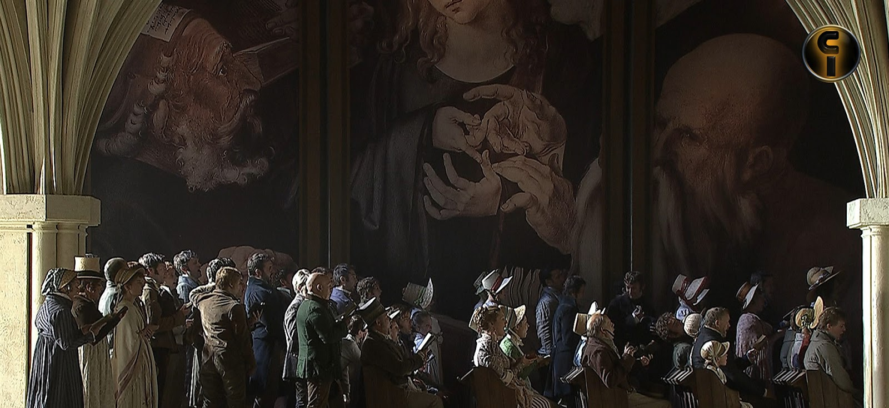

[Óperas](obras.md)
# **Los Maestros Cantores de Nurenberg**

Los maestros cantores de Núremberg (Die Meistersinger von Nürnberg) es una ópera cómica en tres actos con música y libreto de Richard Wagner, estrenada el 21 de junio de 1868 en Múnich. Es una de las pocas óperas de Wagner ambientada en un contexto histórico real, en lugar de un mundo mítico o legendario.

## Argumento

La historia se desarrolla en Núremberg en el siglo XVI y gira en torno a un concurso de canto organizado por los maestros cantores, una asociación de poetas y músicos aficionados.

#### Acto I  

Walther von Stolzing, un joven caballero, se enamora de Eva, la hija del orfebre Veit Pogner.
Pogner ha prometido la mano de Eva al ganador del concurso de canto.
Walther decide participar en el concurso, pero su estilo innovadorchoca con las estrictas reglas de los maestros cantores.

#### Acto II  

Hans Sachs, un zapatero y maestro cantor, reconoce el talento de Walther y decide ayudarlo.
Sixtus Beckmesser, el escribano de la ciudad y rival de Walther, intenta sabotear sus esfuerzos.
Durante la noche, se produce una serie de malentendidos y confrontaciones cómicas.

#### Acto III  

Sachs ayuda a Walther a perfeccionar su canción para el concurso.
En el concurso, Walther canta su obra maestra y gana tanto el concurso como la mano de Eva.
Sachs da un discurso final sobre la importancia de la tradición y la innovación en el arte.

## Música y Estilo 

La ópera es conocida por su rica orquestación y el uso de leitmotivs para representar personajes y conceptos. Incluye momentos musicales destacados como la "Obertura", el "Monólogo de Sachs" y el "Quinteto".  

## Recepción y Legado

"Los maestros cantores de Núremberg" es una de las óperas más largas de Wagner, con una duración de aproximadamente cuatro horas y media. A pesar de su longitud, sigue siendo una de las obras más populares de Wagner y se representa regularmente en teatros de todo el mundo.  

## Enlaces de interés 
[Los maestros cantores de Núremberg - Wikipedia, la enciclopedia libre  ](https://opera-inside.com/los-maestros-cantores-de-nuremberg-de-richard-wagner-guia-y-sinopsis-de-la-opera/?lang=es)    
[Los maestros cantores de Núremberg de Richard Wagner - guía y sinopsis ... ](https://opera-inside.com/los-maestros-cantores-de-nuremberg-de-richard-wagner-guia-y-sinopsis-de-la-opera/?lang=es)   
[Los maestros cantores de Núremberg video](https://www.youtube.com/watch?v=5Jg_PcHvY8E&t=675s)

 [Inicio](README.md)  [BIOGRAFIA](biografia.md) 
