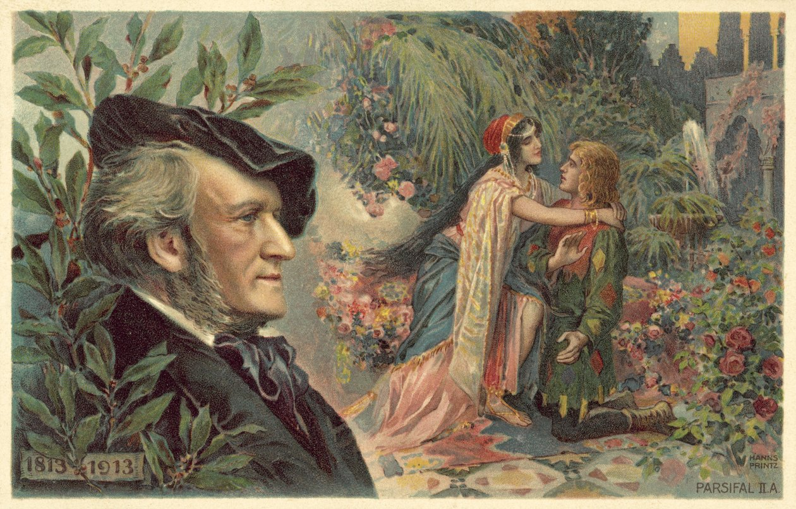

# **Parsifal**  

Parsifal es una ópera en tres actos con música y libreto de Richard Wagner, estrenada el 26 de julio de 1882 en el Festival de Bayreuth. Wagner la describió como un "festival escénico sacro" (Bühnenweihfestspiel), y está basada en el poema épico medieval "Parzival" de Wolfram von Eschenbach.

## Argumento

La ópera sigue la historia de Parsifal y su búsqueda del Santo Grial, explorando temas de redención, compasión y renuncia.  

#### Acto I  

Gurnemanz, un caballero del Grial, encuentra a Parsifal, un joven ingenuo, en el bosque.
Amfortas, el rey del Grial, sufre de una herida incurable causada por la lanza sagrada que fue robada por el mago Klingsor.    
Parsifal presencia una ceremonia del Grial, pero no comprende su significado.   

#### Acto II  

En el castillo de Klingsor, la hechicera Kundry intenta seducir a Parsifal.
Parsifal resiste la tentación y toma la lanza sagrada de Klingsor, prometiendo usarla para sanar a Amfortas.

#### Acto III  

Parsifal regresa al templo del Grial después de años de vagar.
Utiliza la lanza para curar la herida de Amfortas y se revela como el nuevo guardián del Grial.
Kundry, redimida, muere en paz, y Parsifal es aclamado como el salvador.

## Música y Estilo 

"Parsifal" es conocida por su rica orquestación y el uso de leitmotivs para representar personajes y conceptos. La ópera incluye momentos musicales destacados como el "Preludio", la "Música de transformación" y el "Encantamiento del Viernes Santo". 

## Recepción y Legado

"Parsifal" es una de las obras más profundas y espirituales de Wagner, y sigue siendo una pieza central en el repertorio operístico mundial. La ópera ha influido en numerosos compositores y sigue siendo objeto de estudio y admiración por su complejidad musical y filosófica.  

## Enlaces de interés 
PARSIFAL de Richard Wagner - la guía y sinopsis de la ópera  
Parsifal - Wikipedia, la enciclopedia libre  

 [Inicio](README.md)  [BIOGRAFIA](biografia.md) 