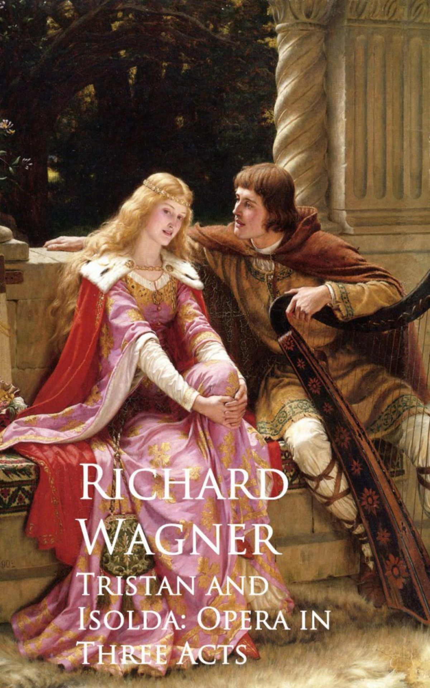

[Óperas](obras.md)
# **Tristán e Isolda**  

Tristán e Isolda (Tristan und Isolde) es una ópera en tres actos con música y libreto de Richard Wagner, basada en la leyenda medieval de Tristán e Isolda. Estrenada el 10 de junio de 1865 en Múnich, esta obra es conocida por su innovador uso del cromatismo, la tonalidad y la suspensión armónica.

## Argumento

La ópera narra la trágica historia de amor entre Tristán, un caballero bretón, e Isolda, una princesa irlandesa.  

#### Acto I  

Tristán está llevando a Isolda a Cornualles para casarse con su tío, el rey Marke.
Isolda, furiosa porque Tristán mató a su prometido Morold, planea envenenarlo, pero su doncella Brangäne sustituye el veneno por un filtro de amor.
Tristán e Isolda beben el filtro y se enamoran perdidamente.

#### Acto II 

En Cornualles, durante una cacería nocturna, Tristán e Isolda se encuentran en secreto.
El rey Marke, avisado por el traidor Melot, sorprende a la pareja.	Tristán, herido por Melot, es llevado de regreso a su castillo por su fiel escudero Kurwenal.

#### Acto III 

Tristán, gravemente herido, espera la llegada de Isolda para curarlo.	Isolda llega justo a tiempo para ver a Tristán morir en sus brazos.
Desesperada, Isolda canta su "Liebestod" (muerte de amor) y muere junto a su amado.

## Música y Estilo 

"Tristán e Isolda" es famosa por su "Acorde de Tristán", que marca un punto de inflexión en la armonía tonal y es considerado uno de los momentos más innovadores de la música occidental. La ópera es un ejemplo temprano del drama musical de Wagner, donde la música y la narrativa están profundamente entrelazadas.

## Recepción y Legado

La ópera fue revolucionaria en su tiempo y sigue siendo una de las obras más influyentes de Wagner. Su exploración del amor, la muerte y la redención ha inspirado a numerosos compositores y sigue siendo una pieza central en el repertorio operístico mundial.  

## Enlaces de interés 

[Tristán e Isolda (ópera) - Wikipedia, la enciclopedia libre ](https://es.wikipedia.org/wiki/Trist%C3%A1n_e_Isolda_%28%C3%B3pera%29)    
[Tristan und Isolde (Wagner) - Argumento y videos - La Opera  ](https://www.youtube.com/watch?v=5Jg_PcHvY8E&t=675s)    
[Tristán e Isolda (ópera) video](https://www.youtube.com/watch?v=tgYokX-4hG8&t=2430s)    
[Conferencia Ramón Gener Tristan und Isolde](https://www.youtube.com/watch?v=2bbwxVBkE7g)    

 [Inicio](README.md)  [BIOGRAFIA](biografia.md) 
